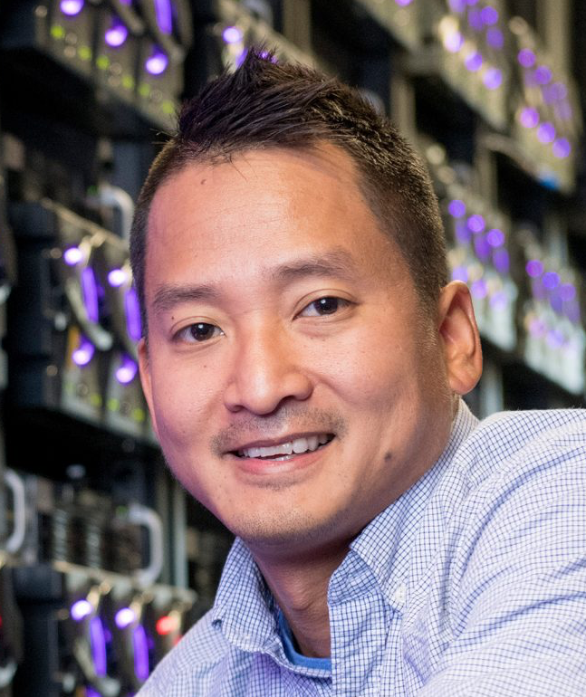

## About me

I am a high energy particle physics experimentalist at Fermilab.  I am interested in understanding the basic building blocks of the universe using particle accelerators to smash particles together and study these collisions in the laboratory.  I am a member of the CMS experiment at the CERN LHC and was extremely fortunate to be a part of the Higgs discovery.  My most recent activities involve study of the Higgs boson, searches for phenomena beyond the Standard Model of particle physics, and understanding nature of dark matter. 

## Research Interests

   * Search for light (MeV-GeV scale) dark matter at the LDMX experiment; development of hadronic veto system

   * Search for exotic hidden hadronic and diboson resonances at CMS

   * Study of the Higgs boson properties via spin correlations and at very high momentum at CMS

   * Development of fast electronics algorithms and hardware for LHC Phase-2 trigger applications

## Education and Professional Experience

### Education

   * Johns Hopkins University, PhD., Physics, 2011  
     (Dissertation) Angles and Daemons: Spin Correlations at the LHC

   * Princeton University, B.A., Physics, 2005

### Professional Experience

   * Fermi National Accelerator Laboratory, Wilson Fellow, 2017

   * Fermi National Accelerator Laboratory, Postdoctoral Researcher, 2011

   * Johns Hopkins University, Graduate Research Assistant, 2006

## Full CV
